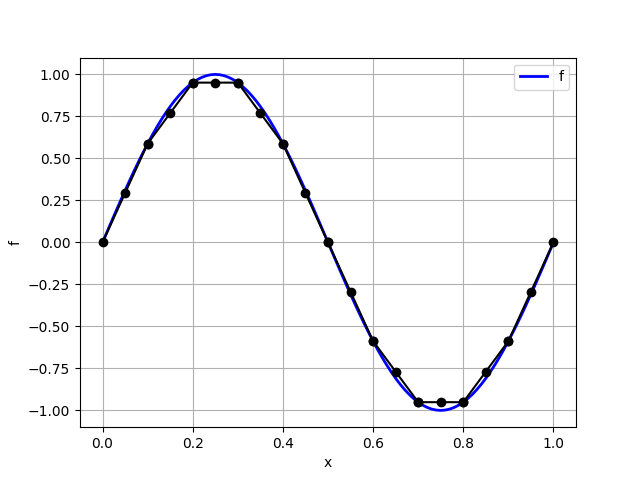
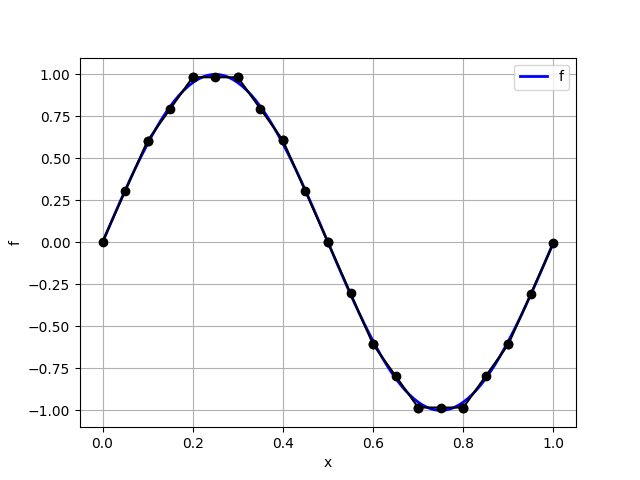
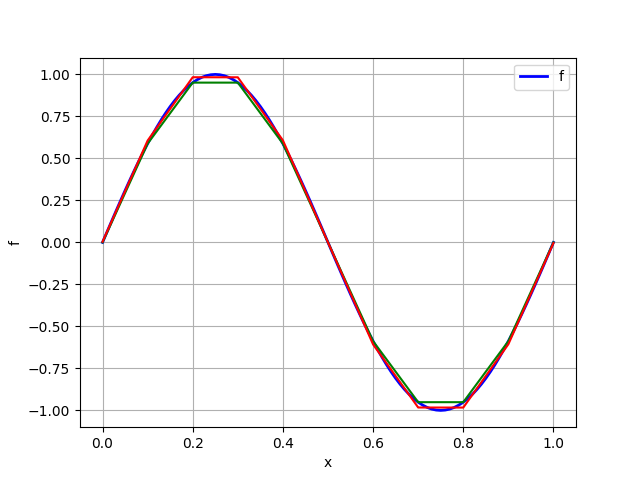

# Projection, Interpolation, and Probes

Before proceeding further, let us understand a bit more about how `scikit-fem` handles scalar fields over a given mesh. We will focus on three functions in particular that are very useful in applications.

## Interpolant vs projection
Suppose that we are given a function $f(x) = \sin(2 \pi x)$. How do we represent it as an element of a $P_1$ finite element space over a mesh of the domain $(0,1)$? One option is to just *interpolate* it at the nodal locations of the mesh. The following code shows how to accomplish this with `scikit-fem`.

``` py
import numpy as np
import skfem 
import skfem.visuals.matplotlib as skplot
import matplotlib.pyplot as plt 

mesh = skfem.MeshLine(np.linspace(0, 1, 11))
elt = skfem.ElementLineP1()
Vh = skfem.Basis(mesh, elt)

f = lambda x: np.sin(2 * np.pi * x[0])

f_interp = f(Vh.doflocs)

list_x = np.linspace(0, 1, 101)
list_f = f(list_x[None,:])

plt.plot(list_x, list_f, 'b-', lw=2, label='f')
skplot.plot(Vh, f_interp, ax=plt.gca())
plt.xlabel('x')
plt.ylabel('f')
plt.grid()
plt.legend()
plt.show()
```

This should return a plot as shown below:


!!! info "Remark"
    Note carefully that the function `f` defined above requires that the vector `x` is input in the `scikit-fem` format. This is the reason for the strange looking `list_f = f(list_x[None,:])`. Note that `list_x` is a 1D array of length 11. `list_x[None,:]` is a 2D array of shape 1 x 11, whose entries are identical to that of `list_x`, except for the shape change. The reason for implementing `f` to receive its argument `x` in the `scikit-fem` format will become clear soon, when we discuss the *projection* operation.

Mathematically, what we have accomplished here is called a *piecewise linear interpolation*. There are, however, other representatives of $f$ in the $P_1$ finite element space $V_h$. For now, let us record the numerical values in `f_interp`.

``` py
>>> np.set_printoptions(precision=3)
>>> f_interp
array([ 0.000e+00,  5.878e-01,  9.511e-01,  9.511e-01,  5.878e-01,
        1.225e-16, -5.878e-01, -9.511e-01, -9.511e-01, -5.878e-01,
       -2.449e-16])
```

A *projection*, or more correctly an *$L_2$ projection*, of a function $f$ onto a finite element space $V_h$ is defined as the function $f_h \in V_h$ such that 
$$
\int_0^1 f_h v \,dx = \int_0^1 f v \, dx,
$$
for any choice of $v \in V_h$. There is a rather straightforward way in which we can solve this problem using `scikit-fem`. Let us look at the direct approach first, followed by a very convenient shortcut that `scikit-fem` provides.

Notice first that the equation $\int_0^1 f_h v\,dx = \int_0^1 fv\,dx$ is of the form $a(u,v) = l(v)$. We can follow the same approach as in the previous example, except that there is no need to impose boundary conditions in the present case (since there are none). The following code snippet does the job---make sure you understand why!

``` py
def a_projection(fh, v, ctx):
    return fh*v

def l_projection(v, ctx):
    x = ctx['x']
    return f(x) * v 

K_projection = skfem.asm(a_projection, Vh)
F_projection = skfem.asm(l_projection, Vh)

f_projection = skfem.solve(K_projection, F_projection)

plt.plot(list_x, list_f, 'b-', lw=2, label='f')
skplot.plot(Vh, f_projection, ax=plt.gca())
plt.xlabel('x')
plt.ylabel('f')
plt.grid()
plt.legend()
plt.show()
```

This should produce the following output:



Let us also record the numerical value of the interpolated function.

``` py
>>> f_projection
array([ 4.193e-03,  6.063e-01,  9.831e-01,  9.828e-01,  6.075e-01,
        1.943e-16, -6.075e-01, -9.828e-01, -9.831e-01, -6.063e-01,
       -4.193e-03])
```

A comparison of `f_projection` with `f_interp` shows us that these are not the same functions in the finite element space $V_h$! A plot of these two functions is shown below to clarify this visually.

``` py
plt.plot(list_x, list_f, 'b-', lw=2, label='f')
skplot.plot(Vh, f_interp, ax=plt.gca(), color='green')
skplot.plot(Vh, f_projection, color='red', ax=plt.gca())
plt.xlabel('x')
plt.ylabel('f')
plt.grid()
plt.legend()
plt.show()
```

This should produce the following plot---the interpolant is shown in green and the projection is shown in red. It should be evident that these are distinct functions in the finite element space.



There are several advantages of the projection operation and it is used widely in practice. For this reason, `scikit-fem` provides a very convenient `project` function attached to a `skfem.Basis` object. We could have thus computed the projection of `f` onto the finite element space `Vh` simply as follows.

``` py
fh = Vh.project(f)
```

To verify this, let us print the contents of `fh` and compare it with the explicitly computed projection values.

``` py
>>> fh
array([ 4.193e-03,  6.063e-01,  9.831e-01,  9.828e-01,  6.075e-01,
        1.943e-16, -6.075e-01, -9.828e-01, -9.831e-01, -6.063e-01,
       -4.193e-03])
```

We see that `fh` is identical to `f_projection`. We will make extensive use of `skfem.Basis.project` to project various functions onto finite element spaces. 

To sum up, interpolating a function in a finite element space is not the same as projecting it onto the same space. These result in distinct functions. We will often use the projection operation, and `scikit-fem` provides a very convenient functionality to implement $L_2$ projections via the `skfem.Basis.project` method.

## `skfem.Basis.interpolate` does not give the interpolant!
There is a very useful function provided by `scikit-fem` called `skfem.Basis.interpolate` that is associate with finite element space. But it *does not* produce an interpolant as discussed above. Rather, it has a very special meaning which is tied t a simple and elegant design choice in `scikit-fem`. Until this point, we have looked at `numpy.ndarray` arrays that are associated with finite element spaces. For instance, the array `fh` defined by `fh = Vh.projec(f)` *lives on the nodes* of the finite element mesh. For the assembly process, however, it is useful to compute the values of the functions belonging to the finite element space at the quadrature locations in each element, along with other useful information like its gradient, hessian, etc. This is what `skfem.Basis.interpolate` does. Let us look at this more closely.

Recall that `scikit-fem` automatically chooses a set of quadrature points when setting up an `skfem.Basis` object; we can also explicitly specify the quadrature points if necessary. For the $P_1$ finite element space `Vh` created above, we can easily compute the location of the quadrature points. The location of the quadrature points in the reference domain can be obtained as follows:

``` py
>>> Vh.quadrature
(array([[0.211, 0.789]]), array([0.5, 0.5]))
```

This tells us that the in the reference domain $[0,1]$, there are two quadrature points located at $0.211$ and $0.789$, with corresponding weights both equal to $1/2$. `scikit-fem` provides a simple means to map points in the reference domain to the physical domain via `skfem.Basis.mapping.F` function. This function takes as argument a list of points as a `numpy.ndarray` array of shape `(dim, npoints)`, where `dim` is the spatial dimension, and `npoints` is the number of points in the reference domain whose global images are sought. This function then returns a `numpy.ndarray` array of shape `(dim, nelt, npoints)`, where `nelt` is the number of elements in the finite element mesh, containing the image of the input points in teh reference domain in each element in the physical domain. 

Let us consider a simple example. For the mesh created earlier, there are 10 elements. The list of midpoints of each element is given by $[0.05, 0.15, \ldots, 0.95]$. Each of these points is the image of the point $0.5$ in the reference domain. To obtain this using `scikit-fem` we can do the following:

``` py
>>> Vh.mapping.F(np.array([[0.5]]))
array([[[0.05],
        [0.15],
        [0.25],
        [0.35],
        [0.45],
        [0.55],
        [0.65],
        [0.75],
        [0.85],
        [0.95]]])
```

Note that this array is of shape `(1,10,1)`. To get the list of all the quadrature point locations in the physical domain, we can do the following:

``` py
>>> Vh.mapping.F(Vh.quadrature[0])
array([[[0.021, 0.079],
        [0.121, 0.179],
        [0.221, 0.279],
        [0.321, 0.379],
        [0.421, 0.479],
        [0.521, 0.579],
        [0.621, 0.679],
        [0.721, 0.779],
        [0.821, 0.879],
        [0.921, 0.979]]])
```

This array is of size `(1,10,2)`. This is the set of points that `skfem.Basis.interpolate` computes the value of any given function in the finite element space. For instance, let us consider the projection `fh` of the function $f$. We can compute the value of this projected function at the global quadrature locations as follows:

``` py
fh_g = Vh.interpolate(fh)
```

When we invoke the `interpolate` function, `scikit-fem` returns an object of type `skfem.DiscreteField` which does much more than just computing the values at the global quadrature points. To see what `scikit-fem` computes, let use the `astuple` attribute to list the contents of this object:

``` py
>>> fh_g.astuple
(array([[ 0.131,  0.479],
        [ 0.686,  0.904],
        [ 0.983,  0.983],
        [ 0.903,  0.687],
        [ 0.479,  0.128],
        [-0.128, -0.479],
        [-0.687, -0.903],
        [-0.983, -0.983],
        [-0.904, -0.686],
        [-0.479, -0.131]]),
 array([[[ 6.021e+00,  6.021e+00],
         [ 3.768e+00,  3.768e+00],
         [-3.812e-03, -3.812e-03],
         [-3.753e+00, -3.753e+00],
         [-6.075e+00, -6.075e+00],
         [-6.075e+00, -6.075e+00],
         [-3.753e+00, -3.753e+00],
         [-3.812e-03, -3.812e-03],
         [ 3.768e+00,  3.768e+00],
         [ 6.021e+00,  6.021e+00]]]),
 None,
 None,
 None,
 None,
 None,
 None,
 None)
```

The first element of the tuple contains the value of the projection of $f$ at the global quadrature points.

``` py
>>> fh_g.astuple[0] # == fh_g.value
array([[ 0.131,  0.479],
       [ 0.686,  0.904],
       [ 0.983,  0.983],
       [ 0.903,  0.687],
       [ 0.479,  0.128],
       [-0.128, -0.479],
       [-0.687, -0.903],
       [-0.983, -0.983],
       [-0.904, -0.686],
       [-0.479, -0.131]])
```

We can also access these values more conveniently using `fh_g.value`.

The second element of the tuple contains the gradient of the projection of $f$, which in the present case is just its derivative, at the global quadrature locations.

``` py
>>> fh_g.astuple[1] # == fh_g.grad
array([[[ 6.021e+00,  6.021e+00],
        [ 3.768e+00,  3.768e+00],
        [-3.812e-03, -3.812e-03],
        [-3.753e+00, -3.753e+00],
        [-6.075e+00, -6.075e+00],
        [-6.075e+00, -6.075e+00],
        [-3.753e+00, -3.753e+00],
        [-3.812e-03, -3.812e-03],
        [ 3.768e+00,  3.768e+00],
        [ 6.021e+00,  6.021e+00]]])
```

We can access this more conveniently as `fh_g.grad`.

For the moment, ignore the rest of the entries which return `None`. Objects of the type `DiscreteField` can also contain other information like divergence, curl, hessian, etc. depending on the nature of the projected function. We will learn more about this later.

In case you are wondering how `scikit-fem` computes the value of the interpolated function and its gradient at the global quadrature points, recall that once we have a finite element space $V_h$, we also have a natural means to compute the value and a function $f_h \in V_h$ at any point using the basis functions $(\phi_k)_{k=1}^N$ as
$$
f_h(x) = \sum_{k=1}^N F_k \phi_k(x),
$$
and its derivative as 
$$
f_h(x) = \sum_{k=1}^N F_k \phi_k'(x).
$$
Here $(F_k)_{k=1}^N$ denotes the values of the projected function at the degrees of freedom of the finite element mesh, which is the array `fh` in this context. The number $N$ here is the total number of degrees of freedom associated with the finite element space $V_h$, which can be obtained using `Vh.N`. 

In summary, `skfem.Basis.interpolate` has little to do with the notion of an interpolant---the naming of this functionality in `scikit-fem` is arguably not an optimal one. Rather, it has a very specific meaning in `scikit-fem` and is used to create an object of the `skfem.DiscreteField` class. This object stores function value and its derivatives at the global quadrature points. This function is very useful in practice and is how we pass in context variables that are finite element functions when invoking `skfem.asm` during the assembly process. 

## Probes compute function value at any desird point in the domain
The `skfem.Basis.interpolate` function computes important quantities related to the function at the global quadrature points. How do we compute the value of a function in the finite element space at an arbitray point in the domain? This is what `skfem.Basis.probes` helps us compute.

Suppose that we wish to compute the value of the finite element function in `Vh` whose degrees of freedom are given by `fh` at a collection of points `x_test`. The collection of points `x_test` need to be a `numpy.ndarray` array of shape `(dim, npoints)` where `dim` is the spatial dimension and `npoints` is the number of points at which the value of the finite element function is to be computed. We first compute a sparse matrix containing values of the basis functions at the collection of points `x_test` using the `skfem.Basis.probes` function, and subsequently perform a matrix multiplication of this matrix with the degrees of freedom vector `fh` to get the desired result. The following code illustrates this:

``` py
>>> x_test = np.array([[0.25, 0.5, 0.75]])
>>> test_probes = Vh.probes(x_test)
>>> f_test = test_probes @ fh
>>> f_test
array([ 9.830e-01,  1.943e-16, -9.830e-01])
```

This is slightly more involved in comparison with other finite element libraries. A simple workaround is to write a small function that automates this set of calculations.

!!! info "Remark"
    Using `skfem.Basis.probes` is non-trivial for vector-valued fields. We will discuss this in detail in a later tutorial.