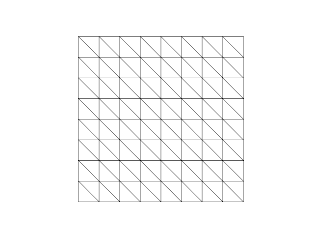
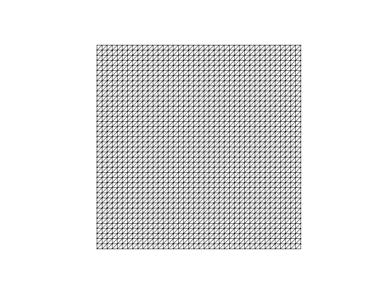
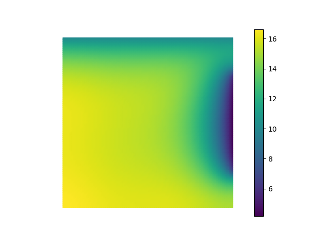

# A heat transfer problem in two dimensions

The discussion thus far has been restricted to the 1D setting to keep the basic ideas accessible. Extending the same ideas to the 2D and 3D setting is relatively straightforward, as we will learn now. All the examples from this point onwards will be in 2D or 3D. Let us look at a two dimensional heat transfer problem to illustrate some additional features of `scikit-fem`. Consider a square domain $\Omega$ of size $L \times L$ as shown below.

 

The temperature distribution $T:\Omega \to \mathbb{R}$ over the domain $\Omega$ satisfies the following Partial Differential Equation (PDE):
$$
\begin{split}
-\kappa \nabla^2 T &= q, \quad \text{in }\Omega,\\
T &= T_0 \quad\text{on }\Gamma_T,\\
-\kappa \nabla T \cdot \mathbf{n} &= 0, \quad\text{on }\Gamma_W,\\
-\kappa \nabla T \cdot \mathbf{n} &= H|\Gamma_C|(T - T_1), \quad\text{on }\Gamma_C.
\end{split}
$$
Here $q$ is a heat source density defined as 
$$
q(\mathbf{x}) = \begin{cases}
Q, & \mathbf{x} \in \omega,\\
0, & \mathbf{x} \in \Omega \setminus \omega.
\end{cases}
$$
In the equation shown above, $\omega \subset \Omega$ is a circular region of radius $R$ whose center is offset by a distance $d$ along both the horizontal and vertical directions from the bottom left corner, as shown in the figure. $Q$ is a constant representing the magnitude of the heat source. The quantities $\kappa, T_0, T_1, H$ are prescribed positive constants, and $\mathbf{n}$ denotes the outward normal at any point on the boundary. 

Three distinct types of boundary are shown: $\Gamma_W$ representing an adiabatic wall that does not allow any heat flux to enter or leave, $\Gamma_T$ representing a part of the boundary where the temperature is prescribed, and $\Gamma_C$ where heat transfer by convection is allowed. $|\Gamma_C|$ denotes the length of the boundary region $\Gamma_C$. 

Our goal is to compute the temperature distribution over the domain $\Omega$, and compute, in particular, the temperature at five points, marked with an X in the figure. The outer points are located at offsets of $(d,d)$ from each corner, and the central point is located at the center of the domain. We will follow the same set of 8 steps as in the one-dimensional example. 

## 1. Weak formulation
To get the weak form of the given PDE, let us choose a test function $\eta:\Omega \to \mathbb{R}$ such that $\eta(\mathbf{x}) = 0$ for $\mathbf{x} \in \Gamma_T$. Notice how we restrict the test function to have a zero value only on the Dirichlet boundary $\Gamma_T$. Multiplying the PDE by the the test function $\eta$ and integrating over the domain $\Omega$, we get
$$
-\int_\Omega \kappa \eta \nabla^2 T \, d\mathbf{x} = \int_\Omega \eta q \, d\mathbf{x}.
$$
Let us now integrate by parts the integral on the left hand side. Towards this end, recall the following vector identity:
$$
\nabla \cdot (\kappa \eta \nabla T) = \kappa \nabla \eta \cdot \nabla T + \kappa \eta \nabla^2 T.
$$
Integrating this over the domain $\Omega$ and rearranging, we see that
$$
-\int_\Omega \kappa \eta \nabla^2 T \, d\mathbf{x} = \int_\Omega \kappa \nabla \eta \cdot \nabla T \, d\mathbf{x} - \int_\Omega \nabla \cdot (\kappa \eta \nabla T)\,d\mathbf{x}.
$$
Using the divergence theorem for the second integral on the right, we get 
$$
-\int_\Omega \kappa \eta \nabla^2 T \, d\mathbf{x} = \int_\Omega \kappa \nabla \eta \cdot \nabla T \, d\mathbf{x} - \int_{\partial\Omega}  \kappa \eta \nabla T \cdot \mathbf{n} \,ds.
$$
Let us now focus on the boundary integral term:
$$
- \int_{\partial\Omega}  \kappa \eta \nabla T \cdot \mathbf{n} \,ds = \int_{\Gamma_W} (-\kappa \nabla T \cdot \mathbf{n}) \eta \, ds + \int_{\Gamma_T} (-\kappa \nabla T \cdot \mathbf{n}) \eta \, ds + \int_{\Gamma_C} (-\kappa \nabla T \cdot \mathbf{n}) \eta \, ds.
$$
The first integral on the right handside vanishes due to the boundary condition $-\kappa \nabla T \cdot \mathbf{n} = 0$ on $\Gamma_W$. The secone integral on the right handside vanishes due to the fact that $\eta = 0$ on $\Gamma_T$. Using the boundary condition $-\kappa \nabla T \cdot \mathbf{n} = h|\Gamma_C|(T_1 - T)$ on $\Gamma_C$, we see that
$$
\begin{split}
- \int_{\partial\Omega}  \kappa \eta \nabla T \cdot \mathbf{n} \,ds &= \int_{\Gamma_C} (-\kappa \nabla T \cdot \mathbf{n}) \eta \, ds\\
 &= \int_{\Gamma_C} H|\Gamma_C|(T - T_1)\eta\,ds.
\end{split}
$$
We have thus shown that 
$$
-\int_\Omega \kappa \eta \nabla^2 T \, d\mathbf{x} = \int_\Omega \kappa \nabla \eta \cdot \nabla T \, d\mathbf{x} + \int_{\Gamma_C} H|\Gamma_C|(T - T_1)\eta\,ds.
$$
Using this in the weak form $-\int_\Omega \kappa \eta \nabla^2 T \, d\mathbf{x} = \int_\Omega \eta q \, d\mathbf{x}$, we get
$$
\int_\Omega \kappa \nabla \eta \cdot \nabla T \, d\mathbf{x} + \int_{\Gamma_C} H|\Gamma_C|(T - T_1)\eta\,ds = \int_\Omega \eta q \, d\mathbf{x}.
$$
Rearranging this, we get the weak form for the heat conduction problem as 
$$
\int_\Omega \kappa \nabla \eta \cdot \nabla T \, d\mathbf{x} + \int_{\Gamma_C} H|\Gamma_C|T\eta\,ds = \int_\Omega \eta q \, d\mathbf{x} + \int_{\Gamma_C} H|\Gamma_C|T_1\eta\,ds.
$$
This can be written in the standard form:
$$
\begin{split}
a(T,\eta) &= l(\eta),\\
a(T,\eta) &= \int_\Omega \kappa \nabla \eta \cdot \nabla T \, d\mathbf{x} + \int_{\Gamma_C} H|\Gamma_C|T\eta\,ds,\\
l(\eta) &= \int_\Omega \eta q \, d\mathbf{x} + \int_{\Gamma_C} H|\Gamma_C|T_1\eta\,ds.
\end{split}
$$
To state the weak formulation more precisely, let us introduce two function spaces:
$$
\begin{split}
V &= \{T:\Omega \to \mathbb{R} \,:\, T = T_0 \text{ on } \Gamma_T\},\\
V_0 &= \{\eta:\Omega \to \mathbb{R} \,:\, \eta = 0 \text{ on } \Gamma_T\}.
\end{split}
$$
We can then state the weak form of the PDE as follows:
$$
\text{find } T \in V \text{ such that } a(T,\eta) = l(\eta) \text{ for all } \eta \in V_0.
$$
Notice how the Dirichlet boundary condition on $\Gamma_T$ is imposed on the solution $T$, while the Neumann and Robin boundary conditions are built into the weak form directly. 

Let us look at how we can transcribe the weak form using `scikit-fem`. For the bilinear form, there are two terms, the first being an area integral, and the second being a line integral. Let us therefore define two functions for each of these integrands and decorate them using `@skfem.BilinearForm`.

``` py
from skfem.helpers import dot, grad

@skfem.BilinearForm
def a_heat_1(T, eta, ctx):
    kappa = ctx['kappa']
    return kappa * dot(grad(T), grad(eta))

@skfem.BilinearForm
def a_heat_2(T, eta, ctx):
    H = ctx['H']
    L = ctx['L']
    W = ctx['W']
    lC = L - 2*W
    return H*lC*T*eta
```

Notice first how the term `dot(grad(T), grad(eta))` looks very similar to what we used in the 1D example. Functionality like `dot`, `grad` permit us to write dimension independent code: `a_heat_1` works in 1D, 2D, and 3D! 

Notice also how the context variable `ctx` is used to extract various relevant constants. These constants will be passed to the bilinear form during assembly as named arguments to the `skfem.asm` function. We will return to this soon.

The linear form can also be implemented similarly.

``` py
def q(x, d, R, Q):
    return ((x[0] - d)**2 + (x[1] - d)**2 - R**2)*Q

@skfem.LinearForm
def l_heat_1(eta, ctx):
    d = ctx['d']
    R = ctx['R']
    Q = ctx['Q']
    x = ctx['x']
    return q(x, d, R, Q) * eta

@skfem.LinearForm
def l_heat_2(eta, ctx):
    H = ctx['H']
    L = ctx['L']
    W = ctx['W']
    lC = L - 2*W
    T1 = ctx['T1']
    return H*lC*T1*eta
```

At this point, there is no indication that either `a_heat_2` or `l_heat_2` is to be integrated over the surface $\Gamma_C$. This information will be specified during the assembly process. 

## 2. Discretize the domain
The domain in this case is a square of dimension $L \times L$. Further, there are three distinct types of boundaries. We will discretize the domain using triangles. Let us set this up in stages. 

`scikit-fem` provides a `skfem.MeshTri()` function to create a structured triangular mesh on the unit square. An example is shown below.

``` py
mesh_unit_square = skfem.MeshTri().refined(3)
skplot.draw(mesh_unit_square)
skplot.show()
```

The `.refined(3)` command refines an initial triangulation of the unit square consisting of just two triangles 3 times. Each refinement splits every triangle into four smaller triangles by joining the midpoints of each edge. The final output is shown below.



The nodes of this mesh can be obtained as `mesh.p`. This is of size `dim x nnodes`, where `dim` is the spatial dimension, 2 in this case, and `nnodes` is the number of nodes, 81 in this case. The element connectivity information can be obtained using `mesh.t`. This is of size `nne x nelt`, where `nne` is the number of nodes per element, 3 in this case, and `nelt` is the number of elements, 128 in this case. Note that the coordinates of node `i` are obtained as `mesh_1.p[:,i]` and the indices of the nodes belonging to element `k` are obtained as `mesh_1.t[:,k]`.

For this problem, we want to rescale the domain to be of extent $L \times L$. There are different ways of accomplishing this. A simple option is to just rescale the node locations of `mesh_1`:

``` py
L = 2.5
mesh_unit_square.p = mesh_unit_square.p * L
```

Alternatively, we can use the `init_tensor` method and pass two `numpy.ndarray` arrays to it to create the desired mesh directly.

``` py
L = 2.5

Nx = 40
Ny = 40

mesh = skfem.MeshTri().init_tensor(
    np.linspace(0, L, Nx+1),
    np.linspace(0, L, Ny+1)
)

skplot.draw(mesh)
skplot.show()
```

This creates a structued mesh as shown below.



We still have to label the boundaries according to the physical domains defined by the problem. `scikit-fem` provides a very convenient `with_boundaries` method for this purpose. The input to this function is a dictionary consisting of a boundary name key with a boolean function identifying the boundary region as its value. For the present problem, we need three distinct types of boundaries. Since we don't need to explicitly specify the zero Neumann boundary condition $-\kappa \nabla T \cdot \mathbf{n} = 0$ on $\Gamma_W$, we only need to label the parts of the boundary where the temperature is specified and where convective heat transfer occurs.

``` py
from functools import reduce

W = 0.5

def convective_boundary(x):
    return reduce(
        np.logical_and,
        (
            np.isclose(x[0], L),
            x[1] > W,
            x[1] < L - W
        )
    )

mesh = mesh.with_boundaries({
    'Temperature': lambda x: np.isclose(x[1], L),
    'Convective': convective_boundary
})
```

The code shown above create two labled boundary parts. The top edge of the square domain is labeled `'Temperature'` and a central strip on the right edge is labeled `'Convective'`. Notice how the functions that define these boundary regions are boolean functions that return `True` when a point is inside the desired boundary and `False` otherwise. For a simple boundary like $\Gamma_T$, we can directly specify this function as a lambda function. For more complex boundaries like $\Gamma_C$, we can create a separate function. The function `convective_boundary` shown above implements the logical condition 
$$
|x - L| < \epsilon \text{ and } y > W \text{ and } y < L - W. 
$$
Here $\mathbf{x} = (x,y)$ are the coordinates of a point $\mathbf{x}$ in the domain, and $\epsilon$ is a small positive tolerance.  

The nodes associated with a boundary label can be accessed as follows:

``` py
>>> mesh.boundaries['Convective']
array([4848, 4849, 4850, 4851, 4852, 4853, 4854, 4855, 4856, 4857, 4858,
       4859, 4860, 4861, 4862, 4863, 4864, 4865, 4866, 4867, 4868, 4869,
       4870, 4871], dtype=int32)
```

## 3. Choose element 
The maximum order of derivative for the trial and test functions in the weak form is 1. Since the mesh consists of triangular elements, a natural choice here is $P_1$ finite elements.

``` py
elt = skfem.ElementTriP1()
```

`scikit-fem` comes built-in with a large list of elements that are commonly used. Further, there is a systematic naming convention---element names start with `Element`, followed by an abbreviated name for the element geometry, `Tri` in this case for a triangle, and finally the order of interpolation, `P1` in this case. A $P_2$ element is named as `ElementTriP2`, a bilinear element on a quadrilateral would is named as `ElementQuad1`, and so on.

## 4. Set up finite element space
The next step is to set up the relevant finite element spaces. For the present problem, we need two distinct finite elements spaces. The first is straightforward:

``` py
Vh = skfem.Basis(mesh, elt)
```

The second one is a bit more subtle. Note that both the bilinear form `a_heat_2` and the linear form `l_heat_2` are to be integrated over part of the boundary, namely $\Gamma_C$. We thus need a finite element space defined only on this boundary to perform the integrals. Given basis functions over the entire mesh, we can restrict them to the desired boundary region to get a *facet* basis. `scikit-fem` provides a `skfem.FacetBasis` class that specializes a given basis to a part of the boundary, as shown below.

``` py
Vf = skfem.FacetBasis(mesh, elt, facets=mesh.boundaries['Convective'])
```

Notice how we are sending in the mesh object `mesh` and the element type over the whole domain `elt`, along with the facet over which we want to restrict the basis, namely $\Gamma_C$. This is specified using the named argument `facets=mesh.boundaries['Convective']`. Once we form the facet basis, we can use it as any other regular basis object, as will be shown in the next step. 

## 5. Assemble stiffness matrix and load vector
The next step in the solution process is the assembly of the stiffness matrix and load vector. Note that the bilinear form consists of two terms. The integrand for the first is stored in `a_heat_1`, while the integrand for the second is `a_heat_2`. The first integrand is to be integrated over the whole domain $\Omega$, while the second is integrated only over the boundary $\Gamma_C$. This is implemented in `scikit-fem` as follows:

``` py
H = 5.0

K = (
        skfem.asm(a_heat_1, Vh, kappa=kappa)
        +
        skfem.asm(a_heat_2, Vf, H=H, L=L, W=W)
    )
```

Notice that the finite element space used in the first term is `Vh`, while that used in the second term is `Vf`. The assembly of the load vector uses a similar construction too.

``` py
d = 0.75
R = 0.5
T1 = 1.0
Q = 10.0

F = (
        skfem.asm(l_heat_1, Vh, d=d, R=R, Q=Q)
        +
        skfem.asm(l_heat_2, Vf, H=H, L=L, W=W, T1=T1)
    )
```

The pattern here should be evident. For weak forms consisting of several terms each of which are integrated over different regions, we need to specify a separate `skfem.Basis` or `skfem.FacetBasis` object for each region, assemble the terms individually, and combine them linearly.

## 6. Apply boundary conditions
Recall that only the Dirichlet boundary conditions need to be specified explicitly for the finite element method. In the present case, we have a non-zero Dirichlet boundary condition on the top face $\Gamma_T$, where the temperature is specified as $T = T_0$. Non-zero dirichlet boundary conditions can be specified by means of the named argument `x= ` in `skfem.condense`, as shown below.

``` py
T0 = 10.0

dirichlet_dofs = Vh.get_dofs('Temperature')
T_dirichlet = Vh.zeros()
T_dirichlet[dirichlet_dofs.all()] = T0

solver_data = skfem.condense(K, F, x=T_dirichlet, D=dirichlet_dofs)
```

Several points need to be understood here. First, the degrees of freedom corresponding to a labeled part of the boundary can be extracted using the `skfem.Basis.get_dofs` function with the label as an argument---this returns a `numpy.ndararray` array. The code `dirichlet_dofs = Vh.get_dofs('Temperature')` does this. To specify the temperatue on this part of the boundary, we need to first create a zero `numpy.ndarray` array of the same size as the number of degrees of freedom in the finite element space. This is what the line `T_dirichlet = Vh.zeros()` does. We then set the specified temperature values only at the Dirichlet degrees of freedom extracted earlier using `T_dirichlet[dirichlet_dofs.all()] = T0`. The object `dirichlet_dofs` is not of type `numpy.ndarray`, but we can use the `.all()` method to get that. Note also that if the specified boundary temperature is spatially non-homogeneous, we can also easily set that by modifying the `T_dirichlet` array accordingly. Finally, we specify the non-zero Dirichlet boundary condition by passing the `T_dirichlet` array as `x=T_dirichlet` to the `skfem.condense` function. If the argument `x=...` is not specfied, `scikit-fem` assigns a zero value by default to the degrees of freedom passed via the `D=...` argument. 

## 7. Solve discrete equations
The solution process is identical to what we saw in the one-dimensional example:

``` py
Th = skfem.solve(*solver_data)
```

## 8. Post-processing
Let us first plot the solution. 

``` py
skplot.plot(Vh, Th, shading='gouraud', colorbar=True, cmap='viridis')
    skplot.show()
```

For the specific numerical values listed above, this should show a plot like the one shown below. 



In addition to plotting the temperature, we also wish to compute the temperature at 5 specific points as indicated in the problem statement. The `skfem.Basis.probes` function helps us compute this---the basic approach is the same as explained in the previous example.

``` py
x_probes = np.array([
        [d, L-d, L-d, d, L/2],
        [d, d, L-d, L-d, L/2]
    ])
    Vh_probes = Vh.probes(x_probes)
    T_probes = Vh_probes @ Th

    for i_probe in range(x_probes.shape[1]):
        print(f'Temperature at ({x_probes[0,i_probe]}, {x_probes[1,i_probe]}) = {T_probes[i_probe]:.2f}')
```

Note that in this case, `x_probes` is a `numpy.ndarray` of size `(2,5)`. For the present case, you should see the following output.

```
Temperature at (0.75, 0.75) = 15.71
Temperature at (1.75, 0.75) = 14.36
Temperature at (1.75, 1.75) = 14.26
Temperature at (0.75, 1.75) = 15.43
Temperature at (1.25, 1.25) = 15.27
```

The full code is provided below. 

``` py
import numpy as np
import matplotlib.pyplot as plt
from functools import reduce

import skfem
import skfem.visuals.matplotlib as skplot
from skfem.helpers import dot, grad


@skfem.BilinearForm
def a_heat_1(T, eta, ctx):
    kappa = ctx['kappa']
    return kappa * dot(grad(T), grad(eta))

@skfem.BilinearForm
def a_heat_2(T, eta, ctx):
    H = ctx['H']
    L = ctx['L']
    W = ctx['W']
    lC = L - 2*W
    return H*lC*T*eta


def q(x, d, R, Q):
    return ((x[0] - d)**2 + (x[1] - d)**2 - R**2)*Q

@skfem.LinearForm
def l_heat_1(eta, ctx):
    d = ctx['d']
    R = ctx['R']
    Q = ctx['Q']
    x = ctx['x']
    return q(x, d, R, Q) * eta

@skfem.LinearForm
def l_heat_2(eta, ctx):
    H = ctx['H']
    L = ctx['L']
    W = ctx['W']
    lC = L - 2*W
    T1 = ctx['T1']
    return H*lC*T1*eta


def convective_boundary(x):
    return reduce(
        np.logical_and,
        (
            np.isclose(x[0], L),
            x[1] > W,
            x[1] < L - W
        )
    )


if __name__ == '__main__':
    kappa = 1.0
    H = 5.0
    d = 0.75
    R = 0.5
    T0 = 10.0
    T1 = 1.0
    Q = 10.0

    L = 2.5
    W = 0.5

    Nx = 40
    Ny = 40

    mesh = skfem.MeshTri().init_tensor(
        np.linspace(0, L, Nx+1),
        np.linspace(0, L, Ny+1)
    )

    skplot.draw(mesh)
    skplot.show()

    mesh = mesh.with_boundaries({
        'Temperature': lambda x: np.isclose(x[1], L),
        'Convective': convective_boundary
    })

    elt = skfem.ElementTriP1()

    Vh = skfem.Basis(mesh, elt)
    Vf = skfem.FacetBasis(mesh, elt, facets=mesh.boundaries['Convective'])

    K = (
        skfem.asm(
            a_heat_1,
            Vh,
            kappa=kappa
        )
        +
        skfem.asm(
            a_heat_2,
            Vf,
            H=H,
            L=L,
            W=W
        )
    )
    F = (
        skfem.asm(
            l_heat_1,
            Vh,
            d=d,
            R=R,
            Q=Q
        )
        +
        skfem.asm(
            l_heat_2,
            Vf,
            H=H,
            L=L,
            W=W,
            T1=T1
        )
    )

    dirichlet_dofs = Vh.get_dofs('Temperature')
    T_dirichlet = Vh.zeros()
    T_dirichlet[dirichlet_dofs.all()] = T0

    solver_data = skfem.condense(K, F, x=T_dirichlet, D=dirichlet_dofs)

    Th = skfem.solve(*solver_data)

    skplot.plot(Vh, Th, shading='gouraud', colorbar=True, cmap='viridis')
    skplot.show()

    x_probes = np.array([
        [d, L-d, L-d, d, L/2],
        [d, d, L-d, L-d, L/2]
    ])
    Vh_probes = Vh.probes(x_probes)
    T_probes = Vh_probes @ Th

    for i_probe in range(x_probes.shape[1]):
        print(f'Temperature at ({x_probes[0,i_probe]}, {x_probes[1,i_probe]}) = {T_probes[i_probe]:.2f}')

```