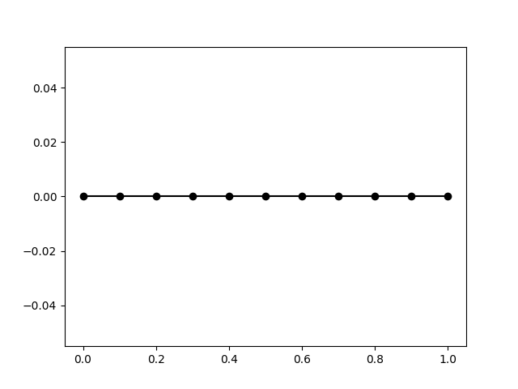
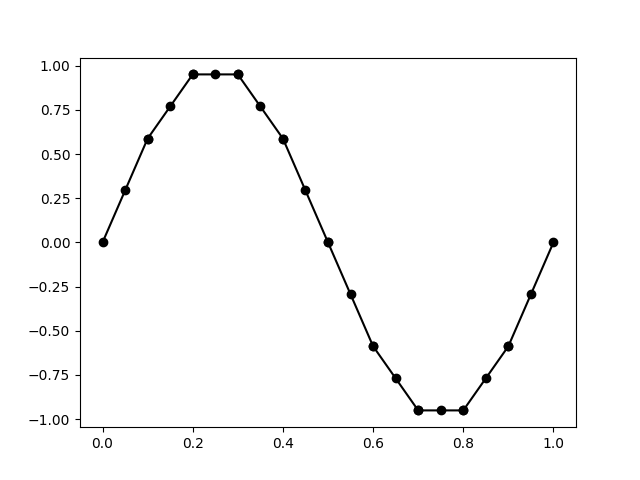

# Linear second order ordinar differential equation

To start with, let us see how we can use `scikit-fem` to solve a simple second order ordinary differential equation. Consider the problem of finding a function $u:[0,1] \to \mathbb{R}$ such that $u(0) = u(1) = 0$, and 
$$
-u''(x) = 4\pi^2 \sin (2\pi x),
$$
for $x \in (0,1)$. Note that this problem can be solved exactly: the solution is $u^\star(x) = \sin (2\pi x)$.

To solve this problem using FEM, we need to peform the following steps---these steps are standard and mostly similar to that in the [scikit-fem documentation](https://scikit-fem.readthedocs.io/en/latest/gettingstarted.html):

1. Formulate the differential equation in weak form.
2. Discretize the domain.
3. Choose element type.
4. Set up finite element space.
5. Assemble stiffness matrix and load vector.
6. Apply boundary conditions.
7. Solve the discretized equations.
8. Post-process solution to extract relevant information. 

Let us look at each of these steps in turn.

## 1. Weak formulation
Put simply, a weak form of a Differential Equation (DE) requires that this DE is true *on average*. More precisely, we require that *every* weighted average of the DE is true. 

In mathematical terms, we choose a *test function* $v:[0,1] \to \mathbb{R}$ such that $v(0) = v(1) = 0$, multiply the DE by $v$, and integrate over the whole domain:
$$
\int_0^1 -u''(x)v(x)\,dx = \int_0^1 4\pi^2 \sin (2\pi x) v(x)\,dx.
$$
We can now integrate the term on teh left hand side by parts to get
$$
-[u'(x)v(x)]_0^1 + \int_0^1 u'(x)v'(x)\,dx = \int_0^1 4\pi^2 \sin (2\pi x) v(x)\,dx. 
$$
Using the boundary conditions $v(0) = v(1) = 0$ for the test function, we get the *weak form* of the DE as
$$
\int_0^1 u'(x)v'(x)\,dx = \int_0^1 4\pi^2 \sin (2\pi x) v(x)\,dx. 
$$
We now insist that this is true for *every* choice of test function $v$ that vanishes at the endpoints of the interval $(0,1)$.

For future use, we can write the foregoing weak form as
$$
a(u,v) = l(v),
$$
where $a(\cdot,\cdot)$ is a *bilinear function* and $l(\cdot)$ is a linear functional. 

In `scikit-fem`, we can directly transcribe the weak form into appropriately *decorated* python functions. We first need to import `scikit-fem`:

``` py
import skfem
```

Let us now focus on the right hand side of the weak form, which is the linear functional 
$$
l(v) = \int_0^1 4\pi^2 \sin (2\pi x) v(x)\,dx. 
$$
To use this in `scikit-fem`, we extract the integrand, which is the functional $v \mapsto f v$, where $f$ is the function $f(x) = 4\pi^2 \sin (2\pi x)$. We then implement this as a Python function decorated with the `@skfem.LinearForm` decorator, as shown below.

``` py
import numpy as np

@skfem.LinearForm
def l(v, ctx):
    x = ctx['x']
    f = 4 * np.pi**2 * np.sin(2 * np.pi * x[0])
    return f * v 
```

Let us unpack this. The `@skfem.LinearForm` decorator informs `scikit-fem` that the function that follows is to be interpreted as the integrand of a linear functional. Procedurally, `scikit-fem` expects such a function to have exactly two arguments, the first is the test function, which is the variable `v` here, and the second is a *context variable*, which is the variable `ctx` here. Think of the context variable as containing *any other information* that we need, other than the test function itself, to specify the linear form. In the present case, note that there is an explicit $x$-dependence in the definition of the linear functional $l$. The context variable `ctx` is a *catch-all* variable that contains all this information. This is a very elegant design feature in `scikit-fem` which is very useful in practice---we will learn more about this as we progress through the tutorials. For now, think of the context variable `ctx` as a dictionary that stores relevant information in the standard `key: value` format. 

!!! info "Remark"
    The `scikit-fem` documentation uses symbols like `w` for the second argument to a `@skfem.LinearForm`-decorated function. We will consistently use the variable name `ctx` to explicitly identify it as a context variable. 

To specify the linear functional $l(v)$, we need to first extract the $x$-coordinate of any point in the domain. By default, the `ctx` variable has a key called `'x'` that stores coordinate information. The coordinates of a point in the domain are thus contained in `ctx['x']`. For a 1D problem as in this case, the $x$-coordinate is obtained as `ctx['x'][0]`.

!!! info "Remark"
    Technically speaking, `ctx['x']` stores the coordinates of the quadrature points in each element in the domain as a `numpy.ndarray` object. We will learn more about this later. 

!!! info "Remark"
    If you are wondering why there is a `[0]` at the end of `ctx['x'][0]`, we will use a similar notation to extract other coordinates in higher dimensions. Thus, in a 2D setting, `ctx['x'][0]` will return $x$-coordinates of the global quadrature points, while `ctx['0'][1]` will return all the corresponding $y$-coordinates. 

In the present case, we first extract the coordinate information in the variable `x` using `x = ctx['x']`, and subsequently define the function `f(x) = 4\pi^2 \sin(2\pi x)` as `f = 4 * np.pi**2 * np.sin( 2 * np.pi * x[0] )`. A really nice feature of `scikit-fem` is that everything is implemented using `numpy` internally and in a vectorized format, so you can freely use `numpy` constants and functions inside `@sfem.<...>`-decorated functions.

Once we have defined the function `f` as above, we can fully specify the integrand in the right hand side as `f * v`. As simple as that!

!!! info "Remark"
    If you are wondering why we are storing only the integrand, and not the whole integral, we will use the this decorated function later during the assembly process to compute the value of the integral. 

Let us now now look at the left hand side of the weak form, which is the bilinear function $a(\cdot, \cdot)$ defined as
$$
a(u,v) = \int_0^1 u'(x) v'(x)\,dx.    
$$
To use this in `scikit-fem`, we extract the integrand, which is the function $(u,v) \mapsto u' v'$, and implement it as a Python function decorated with the `@skfem.BilinearForm`, as shown below.

``` py
from skfem.helpers import dot, grad

@skfem.BilinearForm
def a(u, v, ctx):
    return dot( grad(u), grad(v) )
```

There is a fair bit to unpack here. To start with, the `@skfem.BilinearForm` decorator informs `scikit-fem` that the function that follows is to be interpreted as the integrand of a bilinear form. Accordingly, the first argument, `u` here, is interpreted as the trial function, the second argument, `v` here, is interpreted as the test function, and the third argument, `ctx` here, is interpreted as a context variable.

We now have a new problem. The integrand contains the derivatives of the trial and test functions. How do we compute these? `scikit-fem` stores trial functions and test functions internally as an obect of type `DiscreteField`. A simple mental model you can have of an object of this type is a vector of values of this object stored at the global quadrature locations, along with additional functionality that uses finite element interpolate to compute derivatives. We will learn more about this in detail later. For now, it is sufficient to note that `skfem.helpers` has very convenient functions called `grad` (and a lot more!) that computes the gradient at the global quadrature points. The `dot` function is a little more subtle: it computes the inner product at the quadrature points, resulting in a scalar quantity at the global quadrature points. We will analyze this deeper in a later section. 

Note that the context variable `ctx` is unused in the present case since the bilinear form is entirely specified by the trial and test functions only.

## 2. Discretize the domain
To compute the integrals in the definition of the bilinear form $a$ and the linear form $l$, the strategy adopted in FEM is to subdivide the domain into smaller *elements* and  use an appropriate quadrature rule to numerically integrate integrals over each element to approximate the global integrals. Fundamental to all these operations is a *mesh* of the domain. In the present case, the domain is the interval $[0,1]$, and a mesh in this case is just a collection of non-overlapping intervals whose union is the whole interval. `scikit-fem` provides a convenient `MeshLine` function that takes a collection of ordered points in the interval (inclusive of endpoints) and creates a finite element mesh whose nodes are given by these points. For instance, a uniform mesh with 10 elements is created as follows:

``` py
mesh = skfem.MeshLine( np.linspace(0, 1, 11) )
```

The nodes of the mesh can be accessed using `mesh.p`, and the connectivity of the mesh can be accessed using `mesh.t`, both returning `numpy.ndarray` objects. Here are some typical outputs:

``` py
>>> mesh.p
array([[0. , 0.1, 0.2, 0.3, 0.4, 0.5, 0.6, 0.7, 0.8, 0.9, 1. ]])
```

``` py
>>> mesh.t
array([[ 0,  1,  2,  3,  4,  5,  6,  7,  8,  9],
       [ 1,  2,  3,  4,  5,  6,  7,  8,  9, 10]], dtype=int32)
```

Note that `scikit-fem` uses a different convention than many other finite element software in how these arrays are shaped. The `mesh.p` array is of size `dim x n_nodes` where `dim` denotes the spatial dimension, which in this case is 1, and `n_nodes` denotes the number of nodes in the mesh, which in this case is 11. The connectivity matrix `mesh.t` is of size `nne x n_elts`, where `nne` is the number of nodes per element, which in the present case is 2, and `n_elts` denotes the number of elements in the mesh, which in the present case is 10. 

The `skfem.visuals.matplotlib` module contains a `draw` method that can be used to visualize the mesh. This is a thin wrapper over `matplotlib`, which makes it very convenient to manipulate plots using standard Python commands. 

``` py
import skfem.visuals.matplotlib as skplot 

skplot.draw(mesh)
skplot.show()
```

This should return a plot as shown below:


`scikit-fem` constructs a lot of useful information based on the mesh data. For instance, the nodes on the boundary can be obtained using `mesh.boundary_nodes()`.

## 3. Choose element type
Once we have discretized the domain, we next have to choose how we wish to interpolate a given function over any element in the mesh. This is often referred to as the choice of the *element type* and plays a key role in the finite element method. In the present case, let us choose the approximate solution to be linear over each element, and in a manner that makes it globally continuous. A function of this type is said to be *continuous and piecewise linear*, more commonly referred to as $P_1$ in the finite element literature. `scikit-fem` comes with an exhaustive list of elements, and a reasonably simple procedure to create new element types when necessary. $P_1$ elements in one dimension are created as follows:

``` py
elt = skfem.ElementLineP1()
```

`scikit-fem` computes a variety of attributes for each element type. We will have a detailed look at this later, but for the moment, let us record two important and useful features. Associated with each element are *degrees of freedom*, which may or may not be at the location of the nodes of the element. To list the names of the degrees of freedom, use `elt.dofnames`. In the present case this returns

``` py 
>>> elt.dofnames
['u']
```

By default, `scikit-fem` uses names like `u` to denote the degrees of freedom. This output indicates that the degrees of freedom correspond to a single scalar variable called `u`. The location of these degrees of freedom can be obtained using `elt.doflocs`:

``` py 
>>> elt.doflocs
array([[0.],
       [1.]])
```

This tells you two things: first, there are two degrees of freedom per element, and second, that these degrees of freedom are located at locations $0$ and $1$. These refer to the location of the degrees of freedom on a reference line element, which can be accessed using `elt.refdom`.

## 4. Set up finite element space
Recall that the weak form amounts to finding a function $u$ such that the equation $a(u,v) = l(v)$ is satisfied for *all* admissible test functions $v$---let us call this collection $V$. The essence of the finite element method is to now require that this is true only for a finite dimensional linear subspace of test functions $V_h \subset V$. Mathematically, we say that the finite element solution $u_h$ solves
$$
a(u_h, v) = l(v),
$$
for every $v \in V_h$. In `scikit-fem` finite element spaces like $V_h$ are defined using the `Basis` class. An `skfem.Basis` object is initialized by passing to it a mesh and an element type. In the present case, we can initialize a finite element space as follows:

``` py
Vh = skfem.Basis(mesh, elt)
```

The finite element space contains everything we need for constructing approximate solutions. Each finite element space has associated with a certain number of degrees of freedom, which we can access using `Vh.N`. The location of these degrees of freedom can be obtained using `Vh.doflocs`. Note carefully that the location of the degrees of freedom need not necessarily be the same as the location of nodes in the mesh---for instance, $P_2$ elements will also have degrees of freedom at the center of each element. There are several other useful attributes and methods associated with `skfem.Basis` objects as we will learn shortly. 

## 5. Assemble stiffness matrix and load vector
Having defined the weak form and the appropriate finite element space(s), we can now *assemble* the stiffness matrix and load vector. `scikit-fem` provides a very convenient `skfem.asm` method that takes a bilinear/linear form and appropriate finite element spaces to assemble the global stiffness matrix/load vector. In the present case, the stiffness matrix of size `Vh.N x Vh.N` is obtained using

``` py
K = skfem.asm(a, Vh)
```

The load vector of length `Vh.N` is obtained using

``` py
F = skfem.asm(l, Vh)
```

Note that the `K` and `F` variables are regular `numpy.ndarray` arrays. `skfem.asm` can also take additional arguments to pass context variables. In the present case, only the bilinear form requires the additional context variable `x`, but this is passed implicitly by `scikit-fem`. 

!!! info "Remark"
    `scikit-fem` provides alternative syntax like `K = a.assemble(Vh)` and `F = l.assemble(Vh)` that for assembly. We will consistenly use the `skfem.asm` method for uniformity.

Internally, `scikit-fem` employs quadrature rules to approximate the element stiffnes matrix and element load vector, and the mesh connectivity information and element type to perform the global assembly. You can access the quadrature rule automatically selected by `scikit-fem` using `Vh.quadrature`. You can also set the quadrature rule explicitly---more on this later. 

## 6. Apply boundary conditions
Boundary conditions restrict the values that some degrees of freedom can take on the boundaries. Note that the finite element method requires only the imposition of the Dirichlet boundary condition; Neumann boundary conditions are automatically satisfied by the weak formulation. To obtain degrees of freedom associated with a given finite element discretization, `scikit-fem` provides a very convenient `get_dofs()` method that is associated with an object of type `skfem.Basis`. When called without any arguments, it return all the boundary degrees of freedom, which is what we need here. The `get_dofs()` method, however, is much more powerful and is useful in a wide variety of situations, as we will learn later. For now, let us collect the degrees of freedom associated with the boundaries of the mesh.

``` py 
dirichlet_dofs = Vh.get_dofs()
```

You can list the degrees of freedom by using `dirichlet_dofs.all()`. 

Once you collect the appropriate list of degrees of freedom that need to be constrained, `scikit-fem` provides a bunch of options to enforce these conditions on the stiffness matrix and load vector. The one we will adopt here is the `skfem.condense` method that takes the full stiffness matrix and load vector along with the list of Dirichlet degrees of freedom as input, and returns a list consisting of the reduced stiffnes matrix, load vector, and internal degrees of freedom. The details of this will be presented later; for now, let us collect the output of `skfem.condense` into a tuple called `solver_data`:

``` py 
solver_data = skfem.condense(K, F, D=dirichlet_dofs)
```

Notice how the Dirichlet degrees of freedom are passed in using the `D=dirichlet_dofs` option. By default, `scikit-fem` assigns a zero value to the corresponding degrees of freedom. It is possible to specify non-zero values too, as will be illustrated in a later example. 

In case you wish to extract the condensed stiffness matrix and load vector, these can be obtained as `solver_data[0]` and `solver_data[1]`, respectively.

## 7. Solve discretized equations
To solve the resulting discrete equations, `scikit-fem` uses the sparse linear solvers provided by `scipy`, by default. It is possible, however to use any other linear algebra library in its place. For now, let us stick with the default options. Solving the linear system of equation is easily accomplished by 

``` py 
uh = skfem.solve(*solver_data)
```

Recall that `solver_data` is a tuple; the `*` prefix is a simple mechanism in Python to extract elements of this tuple and pass those as arguments to the function `skfem.solve`. The `skfem.solve` method is a simple wrapper over the sparse linear solvers provided by `scipy`. By default, `scikit-fem` chooses the sparse direct solver, but iterative solvers supported by `scipy` can also be chosen. The output `uh` is a `numpy.ndarray` array. That's it!

We can visualize the computed solution using the `plot` functionality provided by `scikit-fem`:

``` py
skplot.plot(Vh, uh)
skplot.show()
```

This should produce a plot as shown below:


## 8. Postprocessing
In practice, we are interested in one or more quantities that depend on the computed finite element solution. `scikit-fem` provides several tools to extract the relevant information. To get started, let us compute the error associated with the computed finite element solution.

In the present case, we know the exact solution: $u^\star(x) = \sin (2 \pi x)$. One way to measure the error between the approximate and true solutions is by computing the $L_2$ norm of their difference: 
$$
\epsilon^2 = \int_0^1 (u_h - u^\star)^2 \, dx. 
$$
Notice how the mesh and the quadrature rules employed for finite element assembly provide a *natural* means to compute integrals like the one shown above. Unlike the case of bilinear and linear forms, the integral shown above has neither a trial function nor a test function. `scikit-fem` allows us to implement such functionals using the `@skfem.Functional` decorator. The squared $L_2$ error is implemented as follows:

``` py
def u_exact(x):
    return np.sin(2 * np.pi * x)

@skfem.Functional
def sq_error_L2(ctx):
    x = ctx['x']
    u = ctx['u']
    return (u - u_exact(x[0]))**2
```

Notice how functions decorated with the `@skfem.Functional` decorator take only a context variable as an argument. To compute the $L_2$ error of the finite element solution, we need to pass the finite element solution `uh` via the context variable `ctx` to the `sq_error_L2` function. Recall that `uh` is a `numpy.ndarray` array that has the same size as the number of degrees of freedom `Vh.N`. To pass it via a context variable, we need to first convert this to an object of the `DiscreteField` class. As we will learn soon, a `DiscreteField` object lives at the quadrature points of the finite element discretization, not at the degrees of freedom. `scikit-fem` provides a convenient means to compute a `DiscreteField` object from an array of degrees of freedom like `uh` using the `Basis.interpolate` function:

``` py
uh_g = Vh.interpolate(uh)
```

This `interpolate`-ed object is what we need to pass via the context variable. We will explore the internal such objects later. For now, let us see how we can compute the $L_2$ error of the finite element solution:

``` py
L2_error = np.sqrt(
    skfem.asm(sq_error_L2, Vh, u=uh_g)
)
```

Notice how the function interpolated solution object `uh_g` is passed as a named variable in the `skfem.asm` function. Any name can be used to hold context vaiables; the same name should be used inside the `@skfem.Functional` decorated function to access this context variable.

For the specific ODE considered here, you should get an $L_2$ error of $2.298\times{10}^{-2}$.

## The full code
For convenient reference, the full code is provided below:

``` py
import numpy as np
import skfem 
from skfem.helpers import dot, grad
import skfem.visuals.matplotlib as skplot 


@skfem.LinearForm
def l(v, ctx):
    x = ctx['x']
    f = 4 * np.pi**2 * np.sin(2 * np.pi * x[0])
    return f * v 

@skfem.BilinearForm
def a(u, v, ctx):
    return dot( grad(u), grad(v) )


def u_exact(x):
    return np.sin(2 * np.pi * x)

@skfem.Functional
def sq_error_L2(ctx):
    u = ctx['u']
    x = ctx['x']
    return (u - u_exact(x[0]))**2 


if __name__ == '__main__':
    mesh = skfem.MeshLine( np.linspace(0, 1, 11) )
    skplot.draw(mesh)
    skplot.show()

    elt = skfem.ElementLineP1()

    Vh = skfem.Basis(mesh, elt)

    K = skfem.asm(a, Vh)
    F = skfem.asm(l, Vh) 

    dirichlet_dofs = Vh.get_dofs()

    solver_data = skfem.condense(K, F, D=dirichlet_dofs)
    uh = skfem.solve(*solver_data)

    skplot.plot(Vh, uh)
    skplot.show()

    uh_g = Vh.interpolate(uh)
    L2_error = np.sqrt(
        skfem.asm(sq_error_L2, Vh, u=uh_g)
    )

    print(f'FE L2 error = {L2_error:.3e}')
```
