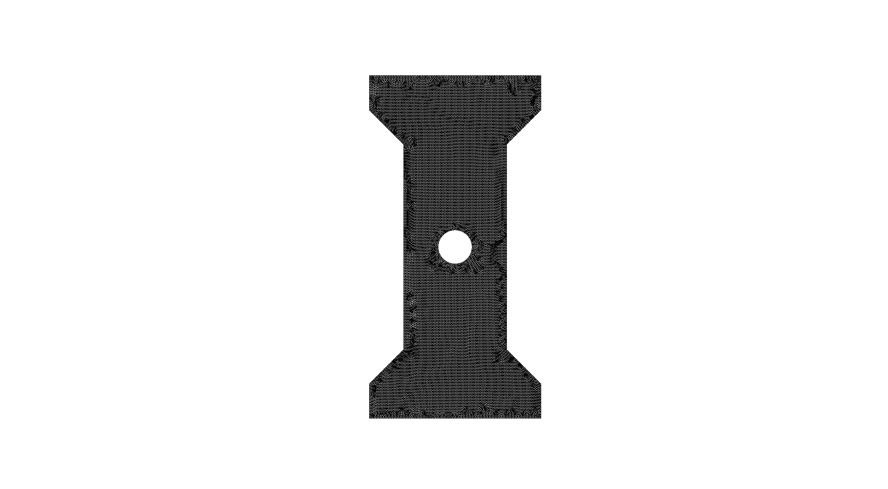
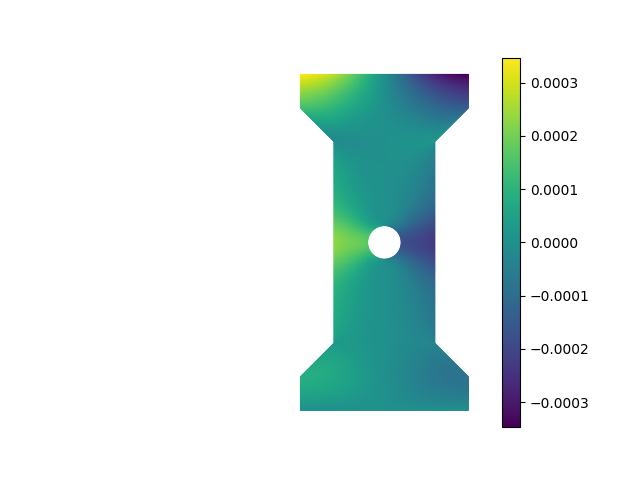
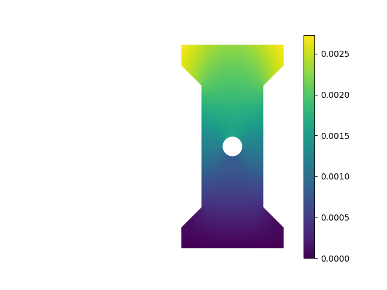
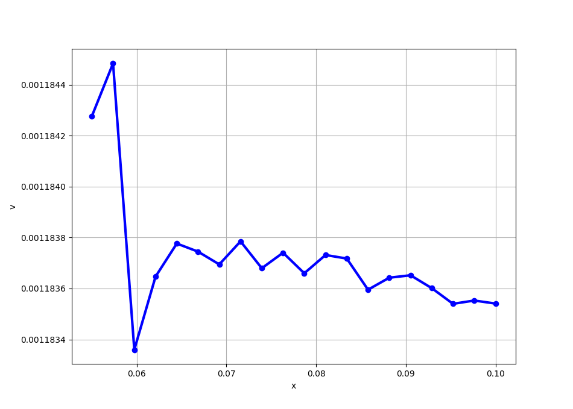
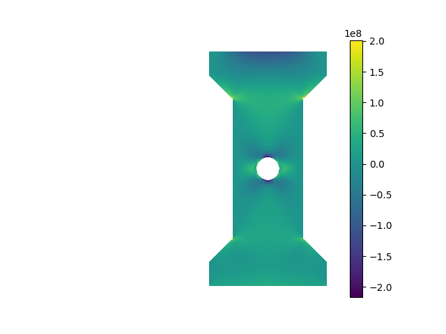
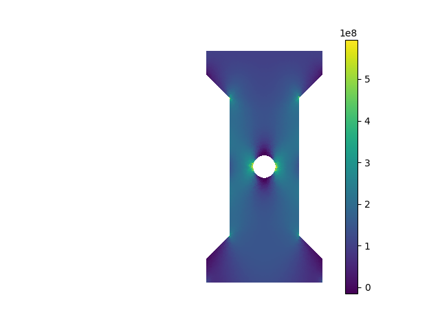
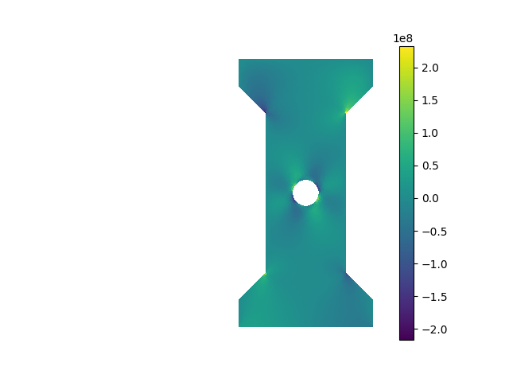
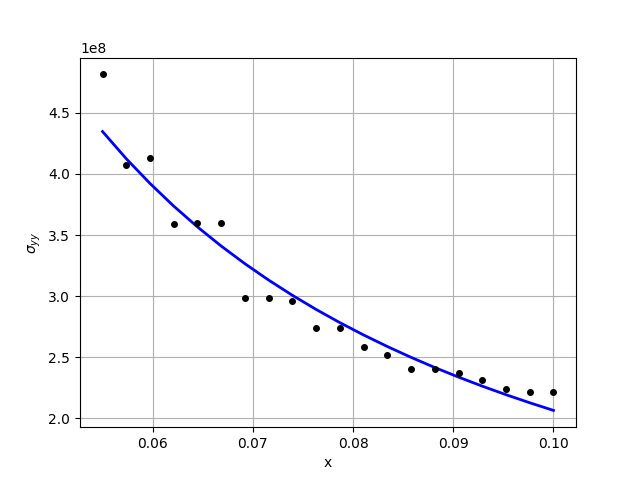

# Linear Elasticity: plane stress problem
As an example of solving a vector-valued PDE, we will now study a classical problem in linear elasticity, namely the occurence of stress concentration around cut-outs. We will also illustrate along the way how we can easily import geometries and meshes created using external CAD/mesh generation software. 

Consider a thin *dog bone* sample with a circular hole that is clamped at the bottom edge and subject to a tensile load at its top edge, as shown in the figure below.


The goal of this problem is to compute the displacement of the structure after loading, and the internal stress distribution. Further, we want to understand how the vertical displacement and the stress component $\sigma_{yy}$ vary radially away from the hole along the horizontal direction. Since the sample is assumed to be thin, we wills study it using the plane stress idealization. 

A tensorial implementation of linear elasticity is provided in the official `scikit-fem` documentation. A different implementation based on the principle of minimum potential energy written using Voigt notation is given here to highlight the flexibility afforded by `scikit-fem`. We will follow the same set of steps as before.

## 1. Weak formulation
As a quick review of the relevant background material, let $\mathbf{u} = (u,v)$ denote the displacement field with $x$-component $u$ and $y$-component $v$. The components of the strain tensor in Voigt notation are given by 
$$
\epsilon(\mathbf{u}) = \begin{bmatrix}
\epsilon_{xx}\\
\epsilon_{yy}\\
2\epsilon_{xy}
\end{bmatrix}
=
\begin{bmatrix}
u_x\\
v_y\\
u_y + v_x
\end{bmatrix}.
$$
In the equation shown above, $u_x = \partial u/\partial x$, $v_y = \partial v/\partial y$, etc. The stress tensor in Voigt notation is given by $[\sigma_{xx}, \sigma_{yy}, \sigma_{xy}]^T$. The stress and strain components are related by means of Hooke's law specialized to the plane stress scenario:
$$
\begin{bmatrix}
\sigma_{xx}\\
\sigma_{yy}\\
\sigma_{xy}
\end{bmatrix}
=
\frac{E}{1 - \nu^2}
\begin{bmatrix}
1 & \nu & 0\\
\nu & 1 & 0\\
0 & 0 & (1 - \nu)/2
\end{bmatrix}
\begin{bmatrix}
\epsilon_{xx}\\
\epsilon_{yy}\\
2\epsilon_{xy}
\end{bmatrix}.
$$
Here $E$ and $\nu$ denote the Young's modulus and Poisson's ratio of the material. We will write this compactly as
$$
\sigma = C\epsilon(\mathbf{u}).
$$
The expression for the strain energy is given by
$$
\mathcal{E}(\mathbf{u}) = \frac{1}{2}\iint_\Omega \epsilon(\mathbf{u})^T \sigma\,d\mathbf{x} = \frac{1}{2}\iint_\Omega \epsilon(\mathbf{u})^T C \epsilon(\mathbf{u})\,d\mathbf{x}.
$$
Here $\Omega$ is the two dimensional domain of the structure. For the problem considered here, there are no body forces, but a surface traction $\mathbf{T}$ is applied at the top edge, which we will denote as $\Gamma_T$. The expression for the work potential is thus given by 
$$
\mathcal{W}(\mathbf{u}) = \int_{\Gamma_T} \mathbf{T}\cdot\mathbf{u}\,ds.
$$
The expression for the potential energy of the system is thus given by 
$$
\Pi(\mathbf{u}) = \mathcal{E}(\mathbf{u}) - \mathcal{W}(\mathbf{u}) = \frac{1}{2}\iint_\Omega \epsilon(\mathbf{u})^T C \epsilon(\mathbf{u})\,d\mathbf{x} - \int_{\Gamma_T} \mathbf{T}\cdot\mathbf{u}\,ds.
$$
According to the principle of minimum potential energy, the equilibrium configuration minimizes the potential energy for any admissible displacement variation $\bar\eta$ that satisfies the Dirichlet boundary conditions. Setting the variation of the potential energy to zero yields the desired weak form 
$$
a(\mathbf{u}, \bar\eta) = \iint_\Omega \epsilon(\bar\eta)^T C \epsilon(\mathbf{u}) \,d\mathbf{x} = \int_{\Gamma_T} \mathbf{T}\cdot\bar\eta\,ds = l(\bar\eta).
$$
To facilitate implementation, let us write down the expression for the bilinear form in term of the components of $\mathbf{u} = (u,v)$ and the components of $\bar\eta = (\xi, \eta)$:
$$
a(\mathbf{u}, \bar\eta) = \frac{E}{1 - \nu^2}\iint_\Omega \begin{bmatrix}
\xi_x\\
\eta_y\\
\xi_y + \eta_x
\end{bmatrix}^T 
\begin{bmatrix}
1 & \nu & 0\\
\nu & 1 & 0\\
0 & 0 & (1 - \nu)/2
\end{bmatrix}
\begin{bmatrix}
u_x\\
v_y\\
u_y + v_x
\end{bmatrix}
\,d\mathbf{x}
$$
We will now transcribe this in a form that `scikit-fem` understands. Let us start with the linear form $l(\bar\eta) = \int_{\Gamma_T} \mathbf{T}\cdot\bar\eta\,ds$ since that is easier to implement.

``` py
from skfem.helpers import dot

@skfem.LinearForm
def l_planestress(eta, ctx):
    T = ctx['T'][0]
    return dot(T, eta)
```

The `dot` function in `skfem.helpers` permits us to take the inner product of two vector valued functions defined at the global quadrature points. The surface traction $\mathbf{T}$ is obtained from the context variable, but notice the peculiar syntax here. The reason for this is that any vector passed in through a context variable is interpreted in a special manner by `scikit-fem`. To overcome this, vectors need to be passed in as a tuple. Thus, when calling `skfem.asm`, the `numpy.ndarray` array `T` is passed as `T = (T,)`. The vector itself is extracted as the first element of this tuple. 

!!! info "Remark"
    This slightly awkward notation is needed just for passing vector valued context variables. But it is also possible to turn this around and pass *every* context as a single tuple, and extracting the individual items in the tuple inside the the `@skfem.BilinearForm`- or `@skfem.LinearForm`- or `@skfem.Functional`-decorated functions. 

Implementing the bilinear form requires slightly more work. Let us look at the implementation first.

``` py
@skfem.BilinearForm
def a_planestress(u, eta, ctx):
    E = ctx['E']
    nu = ctx['nu']
    eps_u = np.array([
        u.grad[0,0],
        u.grad[1,1],
        (u.grad[0,1] + u.grad[1,0])
    ])
    eps_eta = np.array([
        eta.grad[0,0],
        eta.grad[1,1],
        (eta.grad[0,1] + eta.grad[1,0])
    ])
    C = (E/(1 - nu**2)) * np.array([
        [1, nu, 0],
        [nu, 1, 0],
        [0, 0, (1 - nu)/2]
    ])
    return np.einsum('i...,ij,j...', eps_eta, C, eps_u)
```

The first two arguments `u` and `v` to the function `a_planestress` are objects of type `DiscreteField`. This contains information about both the (vector-valued, in this case!) function and its gradient (a matrix, in this case!) at each quadrature point in the domain. The values of `u` at the global quadrature points can be accessed using `u.value`. This is a `numpy.ndarray` array of size `(dim, nelt, nquad)`, where `dim` is the spatial dimension (2 here), `nelt` is the number of elements, and `nquad` is the number of quadrature points per element. The gradients of the displacement vector can be obtained using `u.grad`. This a `numpy.ndarray` array of size `(dim, dim, nelt, nquad)`: `u.grad[0,0]` stores $\partial u/\partial x$, `u.grad[0,1]` stores $\partial u/\partial y$, `u.grad[1,0]` stores $\partial v/\partial x$, and `u.grad[1,1]` stores $\partial v/\partial y$. In the present case, we want to store the components of the strain tensor in voigt notation. This is accomplished by the following code:

``` py
eps_u = np.array([
    u.grad[0,0],
    u.grad[1,1],
    (u.grad[0,1] + u.grad[1,0])
])
```

Note that each of `u.grad[0,0]`, `u.grad[1,1]`, and `(u.grad[0,1] + u.grad[1,0])` are of size `(nelt, nquad)`. Stacking them together as shown yields a `numpy.ndarray` array `eps_u` of shape `(3, nelt, nquad)`. The array `eps_eta` is constructed similarly. Finally, the constitutive matrix `C` is a `(3, 3)` matrix depending on the Young's modulus $E$ and Poisson's ratio $\nu$, both of which are imported via the context variable. To formulate the integrand, we use the very convenient `numpy.einsum` function. This allows us to encode very complex tensorial functions using index notation. In the present case, the code `np.einsum('i...,ij,j..., eps_eta, C, eps_u)` multiplies the first index of `eps_eta` with the first index of `C`, and the second index of `C` with the first index of `eps_u`, while retaining the other dimensions as is. Thus, the net result is a `numpy.ndarray` array of size `(nelt, nquad)`.

## 2. Discretize the domain

For the problem at hand, the domain and mesh are created externally using *Gmsh*. The final mesh is stored in the file `dogbone_hole.msh`. We can easily import external meshes like this in `scikit-fem` as shown below.

``` py
mesh = skfem.MeshTri().load('dogbone_hole.msh')

skplot.draw(mesh)
skplot.show()
```

This should produce the following output---the resolution of the figure shown here is not great, but you should be able to zoom in when you run the commands shown above:



Labels for various boundaries of the mesh, if already defined, can be accessed using the `mesh.boundaries` command. This returns a dictionary where the keys are the label names, and the corresponding values are the edges associated with that label. If you want to just view the names of the labels, you can use `mesh.boundaries.keys()`. 

## 3. Choose element type
All the PDEs we considered so far are *scalar* PDEs. For the linear elasticity problem considered here, the unknown displacement field is a *vector field* $\mathbf{u}(x,y) = (u(x,y), v(x,y))$. While we can represent this using two scalar fields, it is convenient conceptually, mathematically, and numerically, to treat it as a vector field directly. Let us see how we handle vector fields using `scikit-fem`. To start with, let us create a *scalar* element type, which is what we have been using so far.

``` py
elt_s = skfem.ElementTriP1()
```

This element has one degree of freedom associated with each vertex of the triangular element. To create a vector element, we use the `skfem.ElementVector` function with the scalar element type as an input.

``` py
elt = skfem.ElementVector(elt_s)
```

`scikit-fem` automatically creates a vector with as many components as the spatial dimension, 2 in this case, at each degree of freedom associated with the scalar element.

A simple mental picture you can have of scalar and vector elements is as follows: a scalar element represents a scalar function $u$ over an element as 
$$
u(\mathbf{x}) = \sum_{k=1}^M N_k(\mathbf{x}) U_k.
$$
A vector element (in two dimensions, for instance) represents a vector field $\mathbf{u} = (u,v)$ over the element as
$$
\mathbf{u}(\mathbf{x}) = \begin{bmatrix}u(\mathbf{x})\\ v(\mathbf{x})\end{bmatrix} = \sum_{k=1}^M N_k(\mathbf{x}) \mathbf{U}_k = \sum_{k=1}^M N_k(\mathbf{x}) \begin{bmatrix}U_k\\ V_k\end{bmatrix}
$$
Note that the same shape functions are used for each component of the vector field. 

## 4. Set up finite element spaces
Once we have created the vector element, we can create a vector finite element space using the same syntax used for creating scalar finite element spacs. Let us create a scalar finite element space, and a vector finite element space, using the elements just defined.

``` py
Vh_s = skfem.Basis(mesh, elt_s)
Vh = skfem.Basis(mesh, elt)
```

In the present problem, the external loads are applied on an edge $\Gamma_T$. We therefore need to specialize the finite element space to this boundary. The specific part of the boundary we are interested in has the label `Top` in the mesh file `dogbone_hole.msh`. We can restrict the vector finite element space `Vh` to this boundary by using `skfem.FacetBasis` as follows:

``` py
Vf = skfem.FacetBasis(mesh, elt, facets=mesh.boundaries['Top'])
```

Notice how the vector element `elt` is passed as an argument along with the specific facet where we want to specialize it using the `facets=...` argument. This ensures that the facet basis is derived from the full basis. 

!!! info "Remark"
    The term *facet* is used to describe a region that is one dimension less than the spatial dimension. Thus, a facet in two dimensions is an edge, and a facet in three dimensions is a surface. It is also common to say that the *co-dimension* of a facet is 1. 

## 5. Assemble stiffness matrix and load vector
The next step in the finite element method is the assembly of the stiffness matrix and load vector. The stiffness matrix assembly follows the same format as before:

``` py
E = 7e10
nu = 0.3

K = skfem.asm(
    a_planestress,
    Vh,
    E=E,
    nu=nu
)
```

The assembly of the load vector is also similar, but two points need to be noted here. First, the assembly uses the facet basis `Vf` since the load is applied over $\Gamma_T$. Second, to pass a vector-valued context variable, we need to wrap it in a tuple, as mentioned before.

``` py
T = np.array([0.0, 1e8])

F = skfem.asm(
    l_planestress,
    Vf,
    T=(T,)
)
```

!!! info "Remark"
    As mentioned before, there is no restriction on the length of the tuple. We can thus also send in all the relevant context variables, even if they are of different types, as a single tuple. 

## 6. Apply boundary conditions
For the problem at hand, the bottom edge is fixed. We can easily enforce this boundary condition using the same procedure as in the previous examples.

``` py
dirichlet_dofs = Vh.get_dofs('Bottom')
solver_data = skfem.condense(K, F, D=dirichlet_dofs)
```

## 7. Solve discrete equations
We can now solve the condensed discrete equations as before. This problem, however, has a large number of degrees of freedom, so it is preferable to use iterative methods like the conjugate gradient method. `scikit-fem` uses a sparse direct method implemented in `scipy` as the default solver, but we can switch this out to any other solver we want. `scikit-fem` provides a convenient interface to iterative solvers implemented in `scipy`. The code snippet below shows how we can use the `solver=skfem.solver_iter_krylov()` to switch the solver to one of the sparse iterative solvers implemented in `scipy`---the default sparse iterative solver is the conjugate gradient method.

``` py
uh = skfem.solve(*solver_data, solver=skfem.solver_iter_krylov())
```

We can choose other sparse solvers by passing the name of the solver in `scipy` to `skfem.solver_iter_krylov(...)`. In the present case, the stiffness matrix is symmetric and positive definite, so conjugate gradient is a natural choice. We can also specify preconditioners and/or pass other arguments to the sparse solver---these will be discussed in more specialized tutorials later. 

## 8. Post-processing
Let us now post-process the solution to get some useful information out of it. The first thing we want to do is just plot the solution. For vector valued elements, like `Vh` here, `skfem.plot(Vh, uh)` returns a quiver plot, with the arrow sizes chosen according to the magnitude of the vector locally. This may not be the best way to visualize the solution when you have a large number of degrees of freedom as in this case. Let us therefore visualize the individual components of the solution using contour plots.

### Extracting and plotting component fields
We first need to extract the individual components, create a scalar finite element field, and plot them. We have already created the scalar finite element field `Vh_s` earlier, so we just need to extract the $u$- and $v$-components of the solution vector `uh`. For vector elements, `scikit-fem` provides a `skfem.Basis.split_indices()` method for this purpose:

``` py
idx_u, idx_v = Vh.split_indices()
```

Note that there are two outputs because the spatial dimension in this problem is two. We can now access the $u$-component as `uh[idx_u]` and the $v$-component as `uh[idx_v]`. 

A contour plot of the horizontal displacement field $u$ can be plotted as shown below:

``` py
skplot.plot(Vh_s, uh[idx_u], shading='gouraud', colorbar=True, cmap='viridis')
skplot.show()
```



Similarly, a contour plot of the vertical displacement $v$ can be plotted as follows:

``` py
skplot.plot(Vh_s, uh[idx_v], shading='gouraud', colorbar=True, cmap='viridis')
skplot.show()
```




### Probing vector fields at arbitrary locations in the domain
Computing the displacement at an arbitrary location in the domain is slightly non-trivial for vector elements. We will use `skfem.Basis.probes` as before, but the current version of `scikit-fem` cannot directly deal with probing vector elements. Instead, we need to probe the scalar finite element space, and extract the values of the individual displacement components as if they were a scalar field. The code below shows how we can extract the values of the vertical displacement $v$ at a bunch of points along the horizontal direction close to the hole. 

``` py
# Compute vertical displacement along horizontal axis
x_probes = np.array([
    np.linspace(0.055, 0.1, 20),
    np.ones(20)*0.5
])
disp_probes = Vh_s.probes(x_probes)
v_probes = disp_probes @ uh[idx_v]
```

Note carefully how the probe matrix is computed using the scalar finite element space `Vh_s` and not the vector finite element space `Vh`. Further, when computing the values of `v_probes`, only the vertical components `uh[idx_v]` are passed.

!!! info "Remark"
    Probing vector valued fields a bit more tedious in `scikit-fem` compared to other finite element libraries. You can, however, write a separate function for probing vector valued fields if you want to make the syntax look better. 

The variation of the vertical displacement at the probe locations can be visualized as shown below.

``` py
plt.plot(x_probes[0], v_probes, 'bo-', lw=3)
plt.grid()
plt.xlabel('x')
plt.ylabel('v')
plt.show()
```

  

### Computing stresses 
Let us now turn to the calculation of the internal stress distribution in the domain. Recall that stress can be obtained from strain via the linear constitutive relation $\sigma = C\epsilon(\mathbf{u})$, and that the strain can be computed using the displacement field. We, however, know the solution field `uh`. 

There is a small subtle point to be noted here. We approximated the displacement as a $P_1$ field. Since strains are computed by taking derivatives of the displacement, the individual strain components belong to a $P_0$ field. Since stresses are linearly related to strains, stress components also belong to a $P_0$ field. If we had chosen the displacement to be a $P_2$ field, the strain and stress components would belong to a $P_1$ field, and so on. To compute and visualize the stress field, we thus also need to define a new finite element space, $P_0$ in this case. 

``` py
elt_0 = skfem.ElementTriP0()
V0 = skfem.Basis(mesh, elt_0, quadrature=Vh.quadrature)
```

When creating the $P_0$ space `V0`, we have also used the `quadrature=...` argument to pass the quadrature information of the displacement space `Vh`. The reason for doing so is to ensure that we compute the stress components at the same quadrature locations as the original finite element discretization. If we fail to mention this, `scikit-fem` may automatically choose a different set of quadrature points for `V0`, and this can cause errors downstream. 

We can now compute the stress components from the strain components. To compute the strain components, we first need to use `skfem.Basis.interpolate` to move the solution `uh` from the degrees of freedom to the global quadrature points. We can then perform all the desired calculations directly at the global quadrature points since these are *local* calculations. We will then finally project this to the space `V0` to get the desired stress components. The code below illustrates this.

``` py
uh_g = Vh.interpolate(uh)
eps = np.array([
    uh_g.grad[0,0],
    uh_g.grad[1,1],
    (uh_g.grad[0,1] + uh_g.grad[1,0])
])
C = (E/(1 - nu**2)) * np.array([
    [1, nu, 0],
    [nu, 1, 0],
    [0, 0, (1 - nu)/2]
])
sig = np.einsum('ij,j...->i...', C, eps)

sxx = V0.project(sig[0])
syy = V0.project(sig[1])
sxy = V0.project(sig[2])
```

Three points need to be noted here. First, the solution object `uh` is just a `numpy.ndarray` array, so we cannot directly compute its gradient. The `interpolate`-ed object `uh_g` is, however, of the `skfem.DiscreteField` type and can be differentiated: `uh_g.grad` contains the partial derivatives of each component of `uh`. Note that `uh_g.grad` is of shape `(2,2, nelt,nquad`. 

Second, notice how the stresses are computed from the strains using `np.einsum`. Since the consitutive equations are local, we just need to perform the same calculation `\sigma = C\epsilon(\mathbf{u})` at each quadrature point---this is exactly what the line `sig = np.einsum('ij,j...->i...', C, eps)` does. The object `sig` is a `numpy.ndarray` array of size `(3, nelt, nquad)`. 

Third, `scikit-fem` permits projecting to a finite element space directly from an array defined at the quadrature points, shaped like a `skfem.DiscreteField` object. In the present case, `sig[0]` is a `numpy.ndarray` array of shape `(nelt, nquad)`. We can project it to the $P_0$ finite element space `V0` using `sxx = V0.project(sig[0])`. The other stress components are computed similarly.

A contour plot of the stress component $\sigma_{xx}$ is shown below. Note carefully that it is constant on each element and discontinuous across element since it is a $P_0$ field.

``` py
skplot.plot(V0, sxx, colorbar=True, cmap='viridis')
skplot.show()
```



A contour plot of the stress component $\sigma_{yy}$ is shown below.

``` py
skplot.plot(V0, syy, colorbar=True, cmap='viridis')
skplot.show()
```

Notice the stress concentration at the horizontal edges of the circular hole. You can also see stress concentration at the sharp corners of the dogbone structure. 



Finally, a contour plot of the stress component $\sigma_{xy}$ is shown below:

``` py
skplot.plot(V0, sxy, colorbar=True, cmap='viridis')
skplot.show()
```



Finally, let us compute how the stress varies as we move radially outward from the hole. In the absence of the hole, we expect the stress at the midsection to be uniform. The presence of the hole, however, introduces a stress concentration. To compute how the stress increases, we can use `skfem.Basis.probes` to compute the stress $\sigma_{yy}$ at different locations close to the hole, as shown below. 

``` py
stress_probes = V0.probes(x_probes)
syy_probes = stress_probes @ syy
```

Note that we use `V0.probes` above since the stress components live in `V0`. We can fit a power law to this data to understand this better:

``` py
s_coeffs = np.polyfit(np.log(x_probes[0]), np.log(syy_probes), 1)
print(f'Coefficents of power law fit (syy): {s_coeffs}')
```

This should return the following output for the specific numerical values used in this example:

```
Coefficents of power law fit (syy): [-1.24520005 16.27847351]
```

This tells us that the stress component $\sigma_{yy}$ roughly follows a power law behavior of the form $\sigma_{yy} \propto r^{-1.245}$ close to the hole along the horizontal direction. This is plotted below along with the data obtained from the finite element simulation. 

``` py
plt.plot(x_probes[0], np.exp(s_coeffs[1])*x_probes[0]**s_coeffs[0], 'b-', lw=2)
plt.plot(x_probes[0], syy_probes, 'ko', markersize=4)
plt.grid()
plt.xlabel('x')
plt.ylabel(r'$\sigma_{yy}$')
plt.show()
```



The full code is provided below:

``` py
import numpy as np
import matplotlib.pyplot as plt

import skfem
import skfem.visuals.matplotlib as skplot 
from skfem.helpers import dot 


@skfem.BilinearForm
def a_planestress(u, eta, ctx):
    E = ctx['E']
    nu = ctx['nu']
    eps_u = np.array([
        u.grad[0,0],
        u.grad[1,1],
        (u.grad[0,1] + u.grad[1,0])
    ])
    eps_eta = np.array([
        eta.grad[0,0],
        eta.grad[1,1],
        (eta.grad[0,1] + eta.grad[1,0])
    ])
    C = (E/(1 - nu**2)) * np.array([
        [1, nu, 0],
        [nu, 1, 0],
        [0, 0, (1 - nu)/2]
    ])
    return np.einsum('i...,ij,j...', eps_eta, C, eps_u)


@skfem.LinearForm
def l_planestress(eta, ctx):
    T = ctx['T'][0]
    return dot(T, eta)


if __name__ == '__main__':
    E = 7e10
    nu = 0.3

    T = np.array([0.0, 1e8])

    mesh = skfem.MeshTri().load('dogbone_hole.msh')
    
    elt_s = skfem.ElementTriP1()
    elt = skfem.ElementVector(elt_s)

    Vh_s = skfem.Basis(mesh, elt_s)
    Vh = skfem.Basis(mesh, elt)

    Vf = skfem.FacetBasis(mesh, elt, facets=mesh.boundaries['Top'])

    K = skfem.asm(
        a_planestress,
        Vh,
        E=E,
        nu=nu
    )
    F = skfem.asm(
        l_planestress,
        Vf,
        T=(T,)
    )

    dirichlet_dofs = Vh.get_dofs('Bottom')
    solver_data = skfem.condense(K, F, D=dirichlet_dofs)

    uh = skfem.solve(*solver_data, solver=skfem.solver_iter_krylov())

    skplot.plot(Vh, uh)
    skplot.show()

    idx_u, idx_v = Vh.split_indices()

    skplot.plot(Vh_s, uh[idx_u], shading='gouraud', colorbar=True, cmap='viridis')
    skplot.show()

    skplot.plot(Vh_s, uh[idx_v], shading='gouraud', colorbar=True, cmap='viridis')
    skplot.show()

    # Compute vertical displacement along horizontal axis
    x_probes = np.array([
        np.linspace(0.055, 0.1, 20),
        np.ones(20)*0.5
    ])
    disp_probes = Vh_s.probes(x_probes)
    v_probes = disp_probes @ uh[idx_v]

    plt.plot(x_probes[0], v_probes, 'bo-', lw=3)
    plt.grid()
    plt.xlabel('x')
    plt.ylabel('v')
    plt.show()

    # Stress calculation
    elt_0 = skfem.ElementTriP0()
    V0 = skfem.Basis(mesh, elt_0, quadrature=Vh.quadrature)

    uh_g = Vh.interpolate(uh)
    eps = np.array([
        uh_g.grad[0,0],
        uh_g.grad[1,1],
        (uh_g.grad[0,1] + uh_g.grad[1,0])
    ])
    C = (E/(1 - nu**2)) * np.array([
        [1, nu, 0],
        [nu, 1, 0],
        [0, 0, (1 - nu)/2]
    ])
    sig = np.einsum('ij,j...->i...', C, eps)

    sxx = V0.project(sig[0])
    syy = V0.project(sig[1])
    sxy = V0.project(sig[2])

    skplot.plot(V0, sxx, colorbar=True, cmap='viridis')
    skplot.show()

    skplot.plot(V0, syy, colorbar=True, cmap='viridis')
    skplot.show()

    skplot.plot(V0, sxy, colorbar=True, cmap='viridis')
    skplot.show()

    # Compute syy along horizontal axis 
    stress_probes = V0.probes(x_probes)
    syy_probes = stress_probes @ syy

    s_coeffs = np.polyfit(np.log(x_probes[0]), np.log(syy_probes), 1)
    print(f'Coefficents of power law fit (syy): {s_coeffs}')

    plt.plot(x_probes[0], np.exp(s_coeffs[1])*x_probes[0]**s_coeffs[0], 'b-', lw=2)
    plt.plot(x_probes[0], syy_probes, 'ko', markersize=4)
    plt.grid()
    plt.xlabel('x')
    plt.ylabel(r'$\sigma_{yy}$')
    plt.show()
```